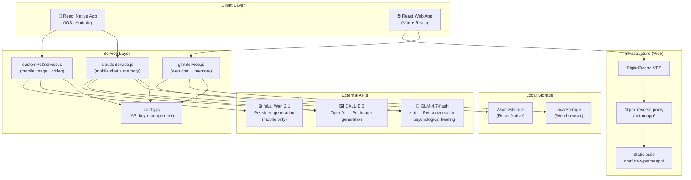
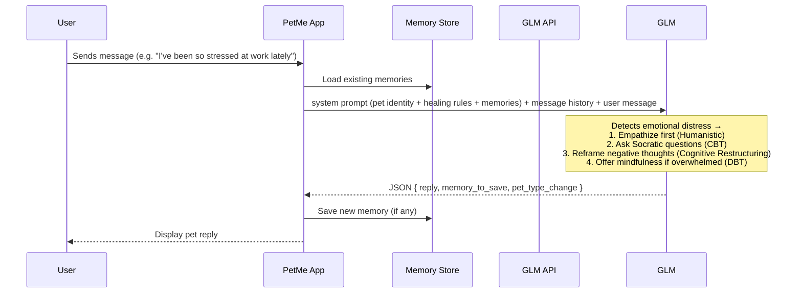

# 🐾 PetMe — Your AI Pet Companion to boost happiness

- PetMe is a cross-platform AI pet companion app available as both a **React Native mobile app** and a **React web app**. Users can chat with a lifelike AI pet, customize its appearance using AI image generation, and receive gentle emotional support with some psychological healing techniques — all delivered through the warm personality of their virtual companion.
- You can try the web version in http://138.197.89.249/petmeapp/
- A simple demo video: https://youtube.com/shorts/wiTfDbWBl5o?si=RAePqPW03Vyzulrg   Note that due to budget limit, currently we can not make the customized pet video generation feature public aviable yet. We are still working on it and hopefully it can be available to everyone soon.
- More features and the mobile app version are under delopment. For example, the customized pet video generation feature will come soon. 
---

## ✨ What It Does

| Feature | Description |
|---|---|
| 💬 **AI Pet Chat** | Converse freely with your pet, powered by GLM API |
| 🎨 **Custom Pet Design** | Describe your dream pet and generate a photorealistic image via DALL-E 3 |
| 🧠 **Memory System** | Your pet remembers things you share and brings them up naturally |
| 💚 **Psychological Healing** | Built-in CBT, humanistic, and mindfulness techniques to support your emotional wellbeing |
| 🎙️ **Voice Conversation** | Speak to your pet and hear it talk back (Web Speech API) |
| 🎬 **Pet Videos** | Generate short animated videos of your pet performing tricks (Still under development) |
| 🌐 **Bilingual** | Full support for English and Chinese |

---

## 👥 Who It's For

- Anyone who wants a fun, emotionally supportive AI companion
- People experiencing everyday stress, anxiety, or loneliness who want a gentle, non-clinical first step toward emotional reflection
- Developers and creators exploring AI-powered companion apps

---

## Why using GLM

- Powerful language models and multi-step workflow to support software development
- Using the GLM API to handle pet conversations and apply some psycological healing techniques

---

## 🏗️ Architecture



### Data Flow — Chat with Psychological Healing



---

## 🚀 Getting Started

### Prerequisites

- Node.js ≥ 18
- npm or yarn
- For mobile: React Native CLI + Xcode (iOS) or Android Studio (Android)
- API keys for GLM (z.ai), OpenAI, and fal.ai — see [Configuration](#️-configuration)

---

### 🌐 Web App (Recommended for quick start)

```bash
# 1. Clone the repo
git clone https://github.com/YOUR_USERNAME/GLMPetMe.git
cd GLMPetMe/petmeapp-web

# 2. Install dependencies
npm install

# 3. Set your API keys (see Configuration section below)
# Edit petmeapp-web/src/config.js

# 4. Start the development server
npm run dev
# → Opens at http://localhost:3001

# 5. Build for production
npm run build
# → Output in petmeapp-web/dist/
```

---

### 📱 Mobile App (React Native)

```bash
# 1. From the repo root
cd GLMPetMe

# 2. Install dependencies
npm install

# 3. Set your API keys (see Configuration section below)
# Edit src/config.js

# 4a. Run on iOS
npx react-native run-ios

# 4b. Run on Android
npx react-native run-android
```

---

## ⚙️ Configuration

All API keys are managed in a single file for each platform. Edit these before running the app:

**Mobile:** `src/config.js`
**Web:** `petmeapp-web/src/config.js`

```js
// config.js — replace with your own keys

// GLM API Key (pet conversation)
// Get yours at: https://z.ai
export const GLM_API_KEY = 'YOUR_GLM_API_KEY';

// OpenAI API Key (DALL-E 3 image generation)
// Get yours at: https://platform.openai.com/api-keys
export const OPENAI_API_KEY = 'YOUR_OPENAI_API_KEY';

// fal.ai API Key (pet video generation — mobile only)
// Get yours at: https://fal.ai/dashboard/keys
export const FAL_KEY = 'YOUR_FAL_API_KEY';
```

> ⚠️ **Never commit real API keys to a public repository.** Add both `config.js` files to `.gitignore`, or replace keys with environment variables before publishing.

---

## 🌍 Deploying the Web App

The web app runs at a subpath (e.g. `http://your-server/petmeapp/`) behind an Nginx reverse proxy, allowing it to share a server with other sites.

```bash
# 1. Build
cd petmeapp-web
npm run build

# 2. Upload dist/ contents to your server
scp -i /path/to/ssh_key -r dist/* root@YOUR_SERVER_IP:/var/www/petmeapp/
```

Add this block inside your Nginx `server {}` config:

```nginx
location /petmeapp/ {
    alias /var/www/petmeapp/;
    index index.html;
    try_files $uri $uri/ =404;
    error_page 404 =200 /petmeapp/index.html;
}
```

Then reload Nginx:

```bash
sudo nginx -t && sudo systemctl reload nginx
```

---

## 💚 How the Psychological Healing Works

When a user expresses emotional distress, the pet automatically applies therapeutic techniques in natural conversation — not clinical or formal, but warm and pet-like.

**Example:** User says _"I've been messing up at work a lot lately and I'm constantly worried."_

| Step | Technique | Pet response style |
|---|---|---|
| 1 | **Empathize** (Humanistic) | "That sounds really exhausting... I can feel how much you're carrying right now 🥺" |
| 2 | **Socratic questions** (CBT) | "What do you think is the worst thing that could happen? And how likely do you think that really is?" |
| 3 | **Cognitive reframing** (CBT) | "When you say 'always messing up' — is that actually true, or might your stressed brain be exaggerating a bit?" |
| 4 | **Grounding** (DBT/Mindfulness) | "Want to try 3 slow deep breaths together first? 🌿 It helps calm that anxious feeling." |
| 5 | **Small action** (Problem-Solving) | "What's one tiny thing — even just 5 minutes — you could do today that might help?" |

---

## 📁 Project Structure

```
GLMPetMe/
├── src/                        # React Native mobile app
│   ├── config.js               # ← API keys (mobile)
│   ├── screens/                # HomeScreen, ChatScreen, MemoryScreen, SettingsScreen
│   ├── services/
│   │   ├── claudeService.js    # GLM chat + healing system prompt
│   │   ├── customPetService.js # DALL-E 3 image + fal.ai video
│   │   └── imageGenService.js  # Scene image generation
│   └── store/
│       └── AppContext.js       # Global state + AsyncStorage
│
└── petmeapp-web/               # React web app (Vite)
    ├── src/
    │   ├── config.js           # ← API keys (web)
    │   ├── screens/            # HomeScreen, ChatScreen, MemoryScreen, SettingsScreen
    │   ├── services/
    │   │   └── glmService.js   # GLM chat + healing system prompt + DALL-E 3
    │   ├── store/
    │   │   └── AppContext.jsx  # Global state + localStorage
    │   └── i18n/
    │       └── index.js        # English + Chinese strings
    └── vite.config.js          # base: '/petmeapp/'
```

---

## 🛠️ Tech Stack

| Layer | Mobile | Web |
|---|---|---|
| Framework | React Native | React 18 + Vite |
| Chat AI | GLM-4.7-flash (z.ai) | GLM-4.7-flash (z.ai) |
| Image Gen | DALL-E 3 (OpenAI) | DALL-E 3 (OpenAI) |
| Video Gen | fal.ai Wan 2.1 | — (not available) |
| Storage | AsyncStorage | localStorage |
| Voice | NativeModules | Web Speech API |
| Deployment | App store / sideload | Nginx on DigitalOcean |

---
